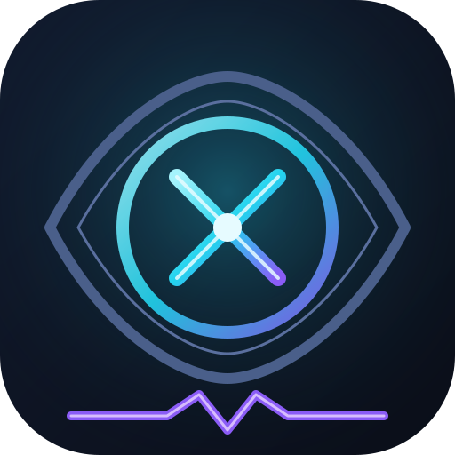

# Lucid

<p align="center"></p>

<p align="center"><b>See straight through Claude Code's agents</b><br>
Lucid puts every Workflow run in clear, live focus: each phase, agent, tool call, token count and duration — one fresh frame every 2 seconds.<br>
Zero dependencies · Local-only · Read-only</p>

<p align="center"><b>English</b> · <a href="README.zh-CN.md">简体中文</a></p>

<p align="center"></p>

## What is Lucid

Lucid is a **local Claude Code plugin**: while a workflow runs, it opens a web page showing, in real time, what every agent inside is doing — from the **global dashboard** (runs / live / done / alerts) down to a **single agent's vital signs** (phase, latest tool, token usage, duration, pending tools, full prompt / result), and further to **session-level step-by-step history**.

It intercepts nothing, injects nothing, modifies nothing — it only reads the state files Claude Code itself writes to disk and serves them through a dependency-free Python standard-library server.

**Why you need it**: while a Workflow runs, its internals are a black box. You want to know "which step is it stuck on", "what tool is this agent running", "how many tokens did that chain burn" — Lucid is built for exactly that moment.

## Features

- **Live transparency**: in-progress runs are reconstructed in real time from the journal + agent transcripts; the frontend polls every 2 seconds and immediately catches up when the page becomes visible or the window regains focus (browsers throttle background-tab timers to ~1 tick/minute — without the catch-up sweep you'd get "typed in the terminal, switched back to the page, still seeing stale state"); completed runs read the full run JSON (complete, rich data)
- **Workflow panorama**: phase bars, an agent table (status / latest tool / tokens / elapsed), run artifacts, system log tail
- **Session monitoring**: main agent (running / **input_required — waiting for you** / waiting / ended) + all non-workflow subagents (task / teammate), pending tools, permission mode, and a tail-window step table **grouped by turn: one user input + all the steps it triggered = one self-contained display unit** — the input line is the group header, left color bars cluster each group (steps are no longer flattened into one long list). Wait reasons split further: **waiting for an answer** (AskUserQuestion / ExitPlanMode pending) and **waiting for permission** (a tool pending and silent ≥2 min, suspected stuck on an approval prompt) — these two mean "truly stuck, your move" and get an inverted ⏸ alert badge + left color bar + a "waiting for …" line showing what it waits on; while **turn finished** (model spoke up, control handed back normally = execution done, no pending tools) is just "idle, waiting for your next message" and takes no alert visuals: a static cyan badge, no color bar, and it is not counted in the `⏸ N` section title either (`notifyInput` governs push notifications — page display is a separate concern)
- **Prompt echo (turn group headers)**: every task unit in a session card starts with a "❯ You said" line — it extracts what the user actually typed from the transcript (tool results / system injections / argument-less commands are automatically dropped; `/goal …` takes `<command-args>`); the group header carries a timestamp and a step-count badge, and expanding it lazily fetches the full input text (anchored by record uuid, same contract as step rows); the very first prompt that fell out of the tail window is marked "earliest"; when a step's opening input lies beyond the tail window, the header says so explicitly and can still be expanded to fetch the full text — attribution is never silently swallowed
- **Pure interactive sessions are listed too**: session candidates = transcript `<sess>.jsonl` ∪ session directory, so sessions without subagents still show up in the monitor (previously only directories were walked, which missed exactly the session most worth flagging as "waiting for you")
- **Full-text drawer**: click any agent / step row to expand details — the complete prompt / result is fetched automatically (deep scan of transcript + journal, replacing the truncated preview); scroll position survives polling. Fetching the full text takes ~1 second, so the drawer plays a short gradient transition while it's in flight: a scanning shimmer previews the pending pane, and on arrival the new content fades in with a one-shot highlight sweep — no more "content swaps in a blink". The right-hand output pane of a session step accumulates **by turn**: one answer is often split across several messages (bridging text + tool + closing text), so the drawer stitches together, in chronological order, the entire output of the turn the step belongs to (since the last real user input) instead of only the latest message. Tool activity counts as full text too — `▸ Tool: input` and `◂ Tool: result` are inlined line by line (an over-long single result is marked "truncated"; a command issued without a result yet is marked "no result yet"). Previously only text blocks were concatenated: for a turn shaped like "bridging sentence: → calls tool", the drawer ended up as a string of sentences ending in colons with nothing after the colon — fixed in 1.2.18
- **Typed notifications**: a background thread pushes two kinds of **Feishu** or **generic JSON** webhooks (no browser has to be open) — ① a workflow reaches a terminal state (completed / failed / killed); ② a session enters `input_required` ("waiting for you"), a separate tier you can switch off or widen (off / **only when stuck** (default: answer + permission) / all including every turn-end), and the generic JSON carries a `kind` field for consumers to route by. The real pain is "it's stuck waiting for me", not "it finished, come look"
- **Self-starting watchdog**: on any session start it checks the service and brings it up if down, restarting it on crash — two trigger doors: the official background monitor (`monitors/monitors.json`, requires Claude Code ≥2.1.105 and host support) plus a `SessionStart` hook fallback (`hooks/hooks.json`, works on any version). Both converge on `scripts/guard.py --detach`: `guard.pid` keeps the resident watchdog loop idempotent, and both the service and the watchdog process outlive the session
- **Multilingual UI**: ⚙ Settings → Language, five languages (简体中文 / English / Español / Français / Deutsch), instant switching with localStorage memory, first visit follows the browser language; all UI copy (card labels, pane titles, empty states, settings panel, notification receipts) goes through one copy layer, and missing translations fall back to Chinese — never blank
- **Ritual-level details**: project filter, full-text search (name / runId / task / status), auto-refresh toggle, five themes: ☀ Daylight / ☾ Phosphor night / ❄ Icefield / ⚡ Magnetic storm / ◈ Ink & iron (localStorage), and changing the port on the web page restarts and migrates automatically
- **Privacy-friendly**: binds `127.0.0.1` only, reads `~/.claude/projects/` only, and the one writable directory is `~/.claude/cc-viewer/` (config / PID / dedupe record)

## How it works

Claude Code writes workflow run state under `~/.claude/projects/<project>/<session>/` (observed in practice):

| File | When | Contents |
|------|------|----------|
| `workflows/wf_*.json` | only on completion | full `workflowProgress` (agent status / tokens / duration / phase), logs, result |
| `subagents/workflows/wf_*/journal.jsonl` | appended live | each agent's `started` / `result` events |
| `subagents/workflows/wf_*/agent-*.jsonl` | grows live | full agent transcript (tail gives the latest tool) |
| `workflows/scripts/<name>-wf_*.js` | written at start | `meta.name` / phases |

The service merges the two data sources: **completed runs read the run JSON (complete data); in-progress runs are reconstructed live from journal + transcripts**. Status determination (as implemented):

| Status | Rule |
|--------|------|
| `running` | parent session process alive (`~/.claude/sessions/<pid>.json` registry) and file activity within 30 min (`STALE_SEC`) |
| `stale` | process alive but >30 min without activity (suspected hang) |
| `completed` | run JSON finished normally; or parent process exited with no unfinished agents |
| `failed` / `killed` | recorded in the run JSON (agent failure / user termination) |
| `aborted` | orphan run: parent session process dead while agents still unfinished |

Scan scope: session directories active in the last N days (N = the "lookback window" setting, default 14, adjustable in ⚙ Settings); metadata of completed runs is cached in-process forever.

## Installation

Prerequisites: macOS / Linux, Claude Code 2.0+, Python 3.9+ (**no pip installs, nothing at all**). The primary self-start entry is the plugin's SessionStart hook (works on any version); the official background monitor (`monitors/monitors.json`) is a second trigger door requiring Claude Code ≥2.1.105 and host support.

**Option 1 (recommended, GitHub marketplace)** — this repository is a standard marketplace, installable from any machine:

```bash
claude plugin marketplace add haixcoder/XRay                 # this repo (marketplace.json, source "./")
claude plugin install lucid@kw-dev-plugins                    # install the plugin
# Version-pinned install (optional, installs a tag snapshot):
# claude plugin marketplace add haixcoder/XRay#v1.2.5   then the same install as above
```

**Option 2 (local development)**:

```bash
claude plugin marketplace add ~/projectDir/cc-viewer     # register the local marketplace (this dir doubles as kw-dev-plugins)
claude plugin install lucid@kw-dev-plugins                # install the plugin
```

Verify:

```bash
claude plugin list                       # should show lucid@kw-dev-plugins ✔ enabled
claude plugin details lucid@kw-dev-plugins  # component list (lucid command, token cost)
```

## Usage

In any Claude Code session, type **`/lucid`** — the service starts automatically (default port 8787, the web setting wins) and your browser opens.

Or manually:

```bash
python3 scripts/server.py --port 8787   # open http://127.0.0.1:8787
python3 scripts/server.py --stop        # graceful stop via PID file (no lsof|kill needed)
```

What `/lucid` does:

1. reads `~/.claude/cc-viewer/config.json` for the port;
2. probes `curl /api/runs` — if the service is already running, reuses it;
3. otherwise starts `server.py` in the background and waits 1s to confirm 200;
4. runs `open http://127.0.0.1:<PORT>` and reports running/completed counts.

> If the port is taken, the service exits immediately and tells you to edit the config or pass `--port`; **after changing the port on the web page, the service `execv`-restarts onto the new port (PID unchanged) and the page follows automatically**.

Day to day you never start anything manually: the plugin's `hooks/hooks.json` (SessionStart, effective on any version) and `monitors/monitors.json` (background monitor, requires Claude Code ≥2.1.105 and host support) both run `guard.py --detach` at every session start to ensure the service is up and to restart it on crash — `/lucid` just also opens the browser. The watchdog loop only writes `~/.claude/cc-viewer/server.log` and `guard.pid`; it touches no existing configuration.

## Page tour

**Top bar**: dashboard (RUNS / LIVE / DONE / ALERT counters — they count the current filtered view; with a project/search filter active, RUNS shows `hits/total` with a hover explanation, so filtered-away runs are never mistaken for bad data), project filter, full-text search, auto-refresh toggle, version badge; top-right "⚙ Settings": 01 webhook (incl. the "input-required notification" tier and ⏸ per-kind test buttons) / 02 port / 03 theme / 04 language / 05 auto-scan / 06 lookback window — theme, language and auto-scan take effect at once, everything else is saved by the footer bar.

**Run list** (in-progress pinned first): status badge (running / completed / failed / killed / stale / aborted), phase bar, agent table (status / latest tool / tokens / elapsed), task details, system log tail, run artifacts.

**AGENT status section** (session layer): main agent status / pending tools / tail-window tokens / permission mode / latest input & output + subagent table (type / model / status / latest tool / tokens / last activity) + the **turn-grouped area** (1.2.20): up to 30 recent real user inputs and up to 30 steps each are clustered by turn into independent task units — the "❯ input" line is the group header (expanding lazily fetches the full text + step-count badge) and its turn's step rows hang beneath it (tool / output preview / tokens / time) with left color bars clustering the group; a brand-new turn with input but no execution yet is its own unit. When a session is **truly stuck** (waiting for an answer / for permission) it floats to the top, highlighted: inverted ⏸ badge + left color bar + a "waiting · your reply / Bash" line carrying the latest output, and the section title counts `⏸ waiting for input N`; turn-end kind (`waitReason=turn`) shows a quiet cyan "turn finished" with its latest output on one expandable line — not counted in ⏸, no flashing — **execution finished ≠ waiting for input**.

**Detail drawer**: click any agent / step row to expand full-width — the **complete** prompt / result is fetched automatically from `/api/agent` / `/api/subagent` (deep scan of transcript + journal, replacing the truncated preview); panes scroll and scroll position survives polling; content is unescaped first (`unent`) and then rendered by the mini markdown renderer (paragraphs / lists / headings / fences / tables).

**Output is always fully viewable**: no log / transcript / error receipt is ever "peek once, that's it" — long text gets a fixed-height scroll box (agent full text, system log tail, run artifacts, the whole JS render-error stack, the notification receipt in Settings); summary rows (the ⏸ wait lines on session cards) open on click and lazily fetch the cumulative full text of the step's turn into a scroll box; if the backend gives 30 log lines the page shows 30 (never halved in the frontend), and **data-source limits are written into the title** (single line ≤500 chars, transcript fields, etc.); when the full text can't be retrieved the page says so explicitly — "⚠ this step is beyond transcript retention" — never a silent blank.

## Webhooks

A server background thread (one round every 5s, no browser required) pushes **two kinds** of messages to Feishu / generic JSON:

| Kind | Trigger | Body |
|------|---------|------|
| `workflow_status` | a workflow reaches a terminal state (completed / failed / killed …) | task name + status, description summary, project & runId, tokens consumed, duration, agents completed, artifact summary |
| `input_required` | a session gets stuck "waiting for you" | `⏸ session waiting for answer/permission(suspected)/input: title`, project · session, **which tool** it waits on, silent duration + permission mode, latest output preview |

`input_required` has its own tier ("⚙ Settings → Webhook → input-required notification"): **off** / **only when stuck** (default: answer + permission only) / **all** (including every turn-end — noisy, useful when you watch several sessions at once). The dedupe key includes "this wait's silence start", so **one wait sends one message**: once you reply, the activity stamp moves forward and the next wait counts as a new event; the first round after a service start seeds silently and never re-sends history. The status itself is a tail-window heuristic (no authoritative journal): "waiting for permission" reads as "suspected" — it is indistinguishable in the transcript from "a long command still running". Configuration lives under "⚙ Settings → Webhook", with two test buttons validating each channel separately. See [scripts/README.md](scripts/README.md) for details.

## HTTP API

| Endpoint | Description |
|----------|-------------|
| `GET /api/runs` | full run snapshot (`{now, runs[]}`; in-progress runs rebuilt live from journal/transcripts) |
| `GET /api/sessions` | session status: main agent (liveness via registry + transcript tail-window inference, status incl. `input_required` + `waitReason`/`waitTool`) + `prompts` (card-top prompt echo: tail-window user-input summaries + uuid + first entry `f:1`) + execution steps + all non-workflow subagents; candidates = transcripts ∪ session dirs, covering active and last-2h sessions, cap 40 |
| `GET /api/agent?proj=&sess=&run=&agent=` | one agent's full transcript + journal events (data source of the run-card drawer) |
| `GET /api/subagent?proj=&sess=&agent=[&msg=]` | session-layer full-text drawer: `agent=main` returns the main session's latest input/output; add `msg=<messageId>` for that step's full text (IN = the step's tool input, OUT = the turn's cumulative output), `msg=<uuid>` for one user input's full text (the prompt-echo anchor); otherwise returns the subagent's task and result |
| `GET /api/config` | current webhook config + recent push results |
| `POST /api/config/save` | save config (URL must be http(s), port 1-65535 and free, `recentDays` 1-3650 default 14, `notifyInput` ∈ off/blocked/all (absent = unchanged); changing the port triggers a self-restart) |
| `POST /api/config/test` | send a test notification to verify connectivity; body `{"kind":"input_required"}` sends a wait-kind one instead |

```bash
curl -s http://127.0.0.1:8787/api/runs | python3 -m json.tool
curl -s "http://127.0.0.1:8787/api/subagent?proj=<proj>&sess=<sess>&agent=main&msg=<msgId>"
```

## Security

- binds `127.0.0.1` only, never exposed to the network;
- all POSTs carry a same-origin `Origin` guard (defends against arbitrary web pages DNS-rebinding into config changes / webhook redirection as an exfiltration channel); scripted calls without `Origin` are allowed through;
- webhook HTTPS validation automatically exports macOS keychain root certificates under corporate TLS proxies; "skip certificate verification" remains a fallback only.

## Project layout

```
Lucid/
├── .claude-plugin/
│   ├── plugin.json        # plugin manifest (name/description/version, shown by the plugin manager)
│   └── marketplace.json   # marketplace manifest — this dir doubles as the kw-dev-plugins marketplace (plugin source "./")
├── assets/
│   ├── lucid-logo.svg      # icon (Lucid eye + focus crosshair + heartbeat line)
│   └── screenshot.png     # UI screenshot
├── frontend/              # frontend source (TS, dev-only; runtime stays zero-dependency)
│   ├── src/*.ts           # 00-types/05-i18n/10-util/20-render/30-app, concatenated by filename order into a global script
│   ├── template.html      # HTML/CSS shell (hand-written; incl. the 3-line theme boot script)
│   ├── build.py           # build: concat → tsc --strict → inject artifact into scripts/ccviewer/static/index.html
│   └── dist/              # intermediate artifacts (not in the install copy, git-ignored)
├── commands/
│   └── lucid.md         # /lucid slash command (commands/ auto-discovered, no manifest entry needed)
├── hooks/
│   └── hooks.json         # SessionStart hook: runs guard.py --detach at session start (primary self-start entry, any version)
├── monitors/
│   └── monitors.json      # official background monitor declaration (same effect as the hook; needs Claude Code ≥2.1.105 + host support)
└── scripts/
    ├── server.py          # entry point: arg parsing, start/stop (core logic lives in the ccviewer/ package)
    ├── guard.py           # self-start/watchdog: --detach idempotently ensures the resident loop; the loop probes TCP liveness → setsid-detached server.py → auto-restart on crash
    ├── README.md          # webhook notification details (Chinese)
    └── ccviewer/          # kernel package (stdlib only)
        ├── config.py      # paths/port/PID and config read/write
        ├── scan.py        # scans ~/.claude/projects and rebuilds run state
        ├── agent.py       # one agent's full prompt/result text
        ├── sessions.py    # main agent + non-workflow subagent status inference
        ├── notify.py      # webhook terminal-state notifier (Feishu / generic JSON)
        ├── web.py         # HTTP handler (page + JSON API)
        └── static/index.html  # frontend runtime file (built from frontend/; plugin distribution/runtime still need no build step)
```

## Architecture at a glance

| Layer | Entry | Notes |
|-------|-------|-------|
| Self-start watchdog | `guard.py --detach` | two trigger doors (SessionStart hook + official monitors, idempotent entry point); the resident loop writes `guard.pid` for cross-session dedupe; TCP probe not listening → `setsid`-detached `server.py` (survives the session); periodic re-check auto-restarts on crash |
| Scan / state rebuild | `scan.scan()` | run JSON is written only on normal completion; in-progress state is rebuilt live from journal.jsonl + agent-*.jsonl |
| Liveness | `scan.live_session_ids()` + `parse_live()` | authoritative signal = `~/.claude/sessions/<pid>.json` registry and a live process; 60s grace against races |
| Webhook notifications | `notify.notify_loop()` | daemon thread, one round per 5s; first round after start seeds silently to prevent historical spam; dedupe via `sent.json` (keeps 800 records) |
| HTTP endpoints | `web.class H` | the page + the 7 JSON APIs above |

The frontend (`frontend/src/*.ts`, global-script mode concatenated by filename order) renders by **per-card diff**: completed cards' data is frozen → the HTML string is stable → the DOM is never rebuilt; only run cards whose data actually changed are rebuilt locally, restoring expanded state and scroll position on rebuild — so repeated refreshes never interrupt reading.

## Development

```bash
python3 frontend/build.py     # frontend: TS → tsc --strict → inject artifact (extracts template.html on first run)
claude plugin validate .      # validate both manifests (add --strict in CI)
python3 scripts/server.py     # foreground start (default 8787, config wins)
```

Iron rules:

1. **Zero dependencies**: `server.py` and the `ccviewer/` package may import stdlib only; **the frontend is TS-only** — the `index.html` script block is a build artifact and must never be hand-edited;
2. **Dual-path trap**: once installed, the plugin runs from the cache copy (`~/.claude/plugins/cache/kw-dev-plugins/lucid/<version>/`); after editing source you must sync + reinstall + restart the service process;
3. **Only version bumps take effect**: `version` in `plugin.json` decides the cache directory; after bumping, reinstalling lands in a new cache dir and old leftovers can be cleaned.

## Known limits

- Session transcripts are read from a **256KB tail window** by default to bound cost; per-step full text uses a **per-msg reverse deep scan (1MB blocks, up to 16MB)** — MB-scale base64 screenshot attachments can push old steps out of the tail window; if even the deep scan can't locate a step, the frontend says "this step is beyond transcript retention" explicitly;
- session scanning covers only "active + last 2h" sessions (cap 40); run scanning covers the last N days (the "lookback window" setting, default 14);
- status inference is a tail-window heuristic (no authoritative journal): under extreme timing, verdicts may lag by ±60s.
