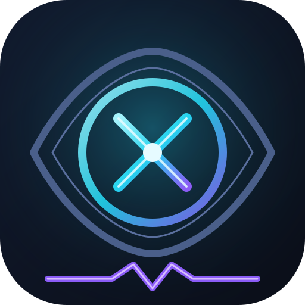
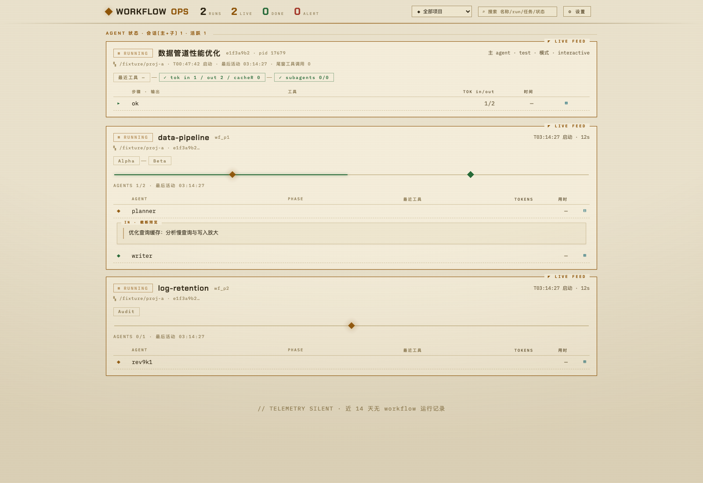

# XRay

<p align="center"></p>

<p align="center"><b>Claude Code 插件的 Workflow 实时透视镜</b><br>
把 Claude 的 Workflow 运行"照成 X 光片"：每个 phase、agent、工具调用、tokens、耗时，2 秒一帧实时可见。<br>
零依赖 · 纯本机 · 只读</p>

<p align="center"></p>

## XRay 是什么

XRay 是一个 **Claude Code 本地插件**：在工作流运行时打开一个网页，实时看到内部每个 agent 正在做什么——
从**全局仪表盘**（运行数 / 存活数 / 完成数 / 告警数）到**单个 agent 的生命体征**
（阶段、最近工具、token 消耗、耗时、pending 工具、完整 prompt / result），再到**会话层的操作步骤回溯**。

它不拦截、不注入、不修改任何东西——只读 Claude Code 自己落盘的状态文件，用零依赖的 Python 标准库服务呈现。

**为什么需要**：Workflow 运行时内部是黑盒。你想知道「它卡在哪一步」「这个 agent 在跑什么工具」「上那条链子烧了多少 token」——XRay 就是为这个时刻准备的。

## 特性

- **实时透视**：进行中的运行由 journal + agent 转录实时重建，前端每 2 秒轮询刷新；已完成的读完整 run JSON（全量富数据）
- **Workflow 全景**：phase 条、agent 表格（状态 / 最近工具 / tokens / 用时）、运行产物、系统日志尾
- **会话监控**：主 agent（running / waiting / ended）+ 全部非 workflow 子代理（task / teammate），pending 工具、权限模式、尾窗步骤表
- **全文抽屉**：点击任意 agent / 步骤行展开详情——自动拉取完整 prompt / result（转录 + journal 深扫全文，替换截断预览），滚动位置跨轮询保持
- **终态通知**：workflow 进入终态（completed / failed / killed）时后台线程推送**飞书**或**通用 JSON** webhook，不依赖浏览器开着
- **仪式感细节**：项目筛选、全文搜索（名称 / runId / 任务 / 状态）、自动刷新开关、五主题切换：☀ 日光台 / ☾ 磷光夜 / ❄ 冰原 / ⚡ 磁暴 / ◈ 墨铁（localStorage 记忆）、网页改端口保存即自动重启迁移
- **隐私友好**：只监听 `127.0.0.1`，只读 `~/.claude/projects/`，唯一可写目录是 `~/.claude/cc-viewer/`（配置 / PID / 去重记录）

## 原理

Claude Code 把 workflow 运行状态落盘在 `~/.claude/projects/<项目>/<session>/` 下（实测）：

| 文件 | 时机 | 内容 |
|------|------|------|
| `workflows/wf_*.json` | 仅完成时写入 | 完整 `workflowProgress`（agent 状态/tokens/耗时/phase）、logs、result |
| `subagents/workflows/wf_*/journal.jsonl` | 实时追加 | 每个 agent 的 `started` / `result` 事件 |
| `subagents/workflows/wf_*/agent-*.jsonl` | 实时增长 | agent 完整转录（tail 可得最近工具） |
| `workflows/scripts/<name>-wf_*.js` | 启动即写 | `meta.name` / phases |

服务合并两个数据源：**已完结的读 run JSON（全量），进行中的由 journal + 转录实时重建**。
状态判定（实例化实现）：

| 状态 | 判定规则 |
|------|----------|
| `running` | 父会话进程存活（`~/.claude/sessions/<pid>.json` 注册表）且 30 分钟内（`STALE_SEC`）有文件活动 |
| `stale` | 进程存活但 >30 min 无活动（疑似挂起） |
| `completed` | run JSON 正常收尾；或父进程已退出且无未完成 agent |
| `failed` / `killed` | run JSON 记录（agent 失败 / 用户终止） |
| `aborted` | 孤儿运行：父会话进程已死且仍有未完成 agent |

扫描范围：最近 N 天内有活动的 session 目录（N = 设置「回看窗口」，默认 14，可在 ⚙ 设置中调整）；已完结 run 的元数据进程内永久缓存。

## 安装

前提：macOS / Linux，Claude Code 2.0+，Python 3.9+（**无需 pip 任何东西**）。

```bash
claude plugin marketplace add ~/projectDir/cc-viewer     # 注册本地市场(本目录兼作市场 kw-dev-plugins)
claude plugin install xray@kw-dev-plugins                # 安装插件
```

验证：

```bash
claude plugin list                       # 应见 xray@kw-dev-plugins ✔ enabled
claude plugin details xray@kw-dev-plugins  # 组件清单(wf-view 命令、token 成本)
```

## 使用

在任意 Claude Code 会话中输入 **`/wf-view`** —— 自动启动服务（默认端口 8787，网页设置优先）并打开浏览器。

或手动：

```bash
python3 scripts/server.py --port 8787   # 打开 http://127.0.0.1:8787
python3 scripts/server.py --stop        # 按 PID 文件优雅停止(免 lsof|kill)
```

`/wf-view` 命令做的事：

1. 读 `~/.claude/cc-viewer/config.json` 取端口；
2. `curl /api/runs` 探测 —— 服务已在运行则直接复用；
3. 未运行则后台拉起 `server.py`，等 1 秒确认 200；
4. `open http://127.0.0.1:<PORT>` 并汇报进行/完成数量。

> 端口被占用时服务直接退出并提示改 config 或换 `--port`；**网页改端口保存后服务 `execv` 自重启到新端口（PID 不变），页面自动跳转**。

## 页面功能

**顶部**：仪表盘（RUNS / LIVE / DONE / ALERT 计数）、项目筛选、全文搜索、自动刷新开关、版本角标；右上「⚙ 设置」：通知钩子、端口、主题，底栏统一保存。

**运行列表**（进行中置顶）：状态徽章（running / completed / failed / killed / stale / aborted）、phase 条、agent 表格（状态 / 最近工具 / tokens / 用时）、任务详情、系统日志尾、运行产物。

**AGENT 状态区**（会话层）：主 agent 状态 / pending 工具 / 尾窗 tokens / 权限模式 / 最近输入输出 + 子代理表（类型 / 模型 / 状态 / 最近工具 / tokens / 最后活动）+ 尾窗 30 条执行步骤表（工具 / 输出预览 / tokens / 时间）。

**详情抽屉**：点击任意 agent / 步骤行全宽展开——自动从 `/api/agent` / `/api/subagent` 拉取**完整** prompt / result（转录 + journal 深扫，替换截断预览），pane 内可滚动且滚动位置跨轮询保持；由实体转义还原（`unent`）后经迷你 markdown 渲染器呈现（分段 / 列表 / 标题 / 围栏 / 表格）。

## 通知钩子

workflow 进入**终态**时由服务器后台线程（5s 扫描，不要求浏览器开着）推送飞书 / 通用 JSON：
任务名 + 状态、描述摘要、项目与 runId、消费 token、用时、agent 完成数、产物概要。
配置入口在「⚙ 设置 → 通知钩子」，支持测试连通。详见 [scripts/README.md](scripts/README.md)。

## HTTP API

| 端点 | 说明 |
|------|------|
| `GET /api/runs` | 全量运行快照（`{now, runs[]}`；进行中由 journal/转录实时重建） |
| `GET /api/sessions` | 会话状态：主 agent（注册表判活 + 转录尾窗推断）+ 执行步骤 + 全部非 workflow 子代理；含活跃会话与最近 2h 会话，上限 40 |
| `GET /api/agent?proj=&sess=&run=&agent=` | 单 agent 完整转录 + journal 事件（运行卡抽屉数据源） |
| `GET /api/subagent?proj=&sess=&agent=[&msg=]` | 会话层全文抽屉：`agent=main` 返回主会话最近输入/输出；加 `msg=<messageId>` 返回该步骤全文；否则返回子代理任务与结果 |
| `GET /api/config` | 当前 webhook 配置 + 最近推送结果 |
| `POST /api/config/save` | 保存配置（URL 须 http(s)、端口 1-65535 且空闲、`recentDays` 1-3650 默认 14；改端口触发自重启） |
| `POST /api/config/test` | 发送测试通知验证连通 |

```bash
curl -s http://127.0.0.1:8787/api/runs | python3 -m json.tool
curl -s "http://127.0.0.1:8787/api/subagent?proj=<proj>&sess=<sess>&agent=main&msg=<msgId>"
```

## 安全

- 仅绑定 `127.0.0.1`，不对外网开放；
- 所有 POST 带同源 Origin 守卫（防任意网页 DNS rebinding 后改配置 / 重定向 webhook 做外泄通道），无 Origin 的脚本调用放行；
- webhook 的 HTTPS 在公司 TLS 代理下自动导出 macOS 钥匙串根证书完成校验，「跳过证书校验」仅作兜底。

## 项目结构

```
XRay/
├── .claude-plugin/
│   ├── plugin.json        # 插件清单(名称/描述/版本,plugin manager 展示来源)
│   └── marketplace.json   # 市场清单 —— 本目录同时就是 kw-dev-plugins 市场(插件 source 为 "./")
├── assets/
│   ├── xray-logo.svg      # 图标(X 射线透视眼 + 心跳线)
│   └── screenshot.png     # 界面截图
├── frontend/              # 前端源码(TS,仅开发用;运行时零依赖不变)
│   ├── src/*.ts           # 00-types/10-util/20-render/30-app,按名序拼接为全局脚本
│   ├── template.html      # HTML/CSS 壳(手写;含 3 行主题 boot 内联脚本)
│   ├── build.py           # 构建:拼接→tsc --strict→注入产物到 scripts/ccviewer/static/index.html
│   └── dist/              # 中间产物(不进安装副本,git 忽略)
├── commands/
│   └── wf-view.md         # /wf-view 斜杠命令(commands/ 自动发现,无需在清单中声明)
└── scripts/
    ├── server.py          # 入口:参数解析、启动/停止(核心逻辑在 ccviewer/ 包)
    ├── README.md          # webhook 通知钩子详解
    └── ccviewer/          # 内核包(仅 stdlib)
        ├── config.py      # 路径/端口/PID 与配置读写
        ├── scan.py        # 扫描 ~/.claude/projects 与运行状态重建
        ├── agent.py       # 单 agent 完整 prompt/result 全文
        ├── sessions.py    # 主 agent + 非 workflow 子代理状态推断
        ├── notify.py      # webhook 终态通知线程(飞书/通用 JSON)
        ├── web.py         # HTTP handler(页面 + JSON API)
        └── static/index.html  # 前端运行时文件(由 frontend/ 构建产生;插件分发/运行时仍无构建)
```

## 架构速览

| 层 | 入口 | 要点 |
|----|------|------|
| 扫描/状态重建 | `scan.scan()` | run JSON 只在正常收尾时写；进行中状态由 journal.jsonl + agent-*.jsonl 实时重建 |
| 存活判定 | `scan.live_session_ids()` + `parse_live()` | 权威信号 = `~/.claude/sessions/<pid>.json` 注册表且进程存活；60s 宽限防竞态 |
| Webhook 通知 | `notify.notify_loop()` | 守护线程 5s 一轮；启动首轮静默播种防刷屏；去重靠 `sent.json`（保留 800 条） |
| HTTP 端点 | `web.class H` | 页面 + 上述 7 个 JSON API |

前端（`frontend/src/*.ts`，全局脚本模式按名序拼接）按**卡 diff** 渲染：完成卡数据冻结 → HTML 串稳定 → DOM 永不重建；仅数据真变的运行卡局部重建，重建时恢复展开态与滚动位置——所以多轮刷新不打断阅读。

## 开发

```bash
python3 frontend/build.py     # 前端:TS→tsc --strict→注入产物(首次自动抽 template.html)
claude plugin validate .      # 校验两份清单(CI 加 --strict)
python3 scripts/server.py     # 前台启动(默认 8787,config 优先)
```

铁律：

1. **零依赖**：`server.py` 与 `ccviewer/` 包只许 import stdlib；**前端只许 TS**，`index.html` 脚本块是 build 产物禁止手改；
2. **双路径陷阱**：插件安装后运行时加载的是缓存副本（`~/.claude/plugins/cache/kw-dev-plugins/xray/<版本>/`），改完源码要同步 + 重装 + 重启服务进程；
3. **改版本才生效**：`plugin.json` 的 `version` 决定缓存目录，升版本后重装落到新 cache 目录，旧版本残留可清理。

## 已知边界

- 会话转录默认只读**尾窗 256KB** 控制成本；步骤全文走**按 msg 反向深扫（1MB 块，至 16MB）**——截图附件是 MB 级 base64 时会把旧步骤挤出尾窗，深扫也定位不到则前端显式提示「该步已超出转录留存范围」；
- 会话扫描只覆盖「活跃 + 近 2h」会话（上限 40）；run 扫描覆盖最近 N 天（近期「回看窗口」设置，默认 14）；
- 状态推断是尾窗启发式（无权威 journal），极端时序下可能有 ±60s 的判定延迟。
